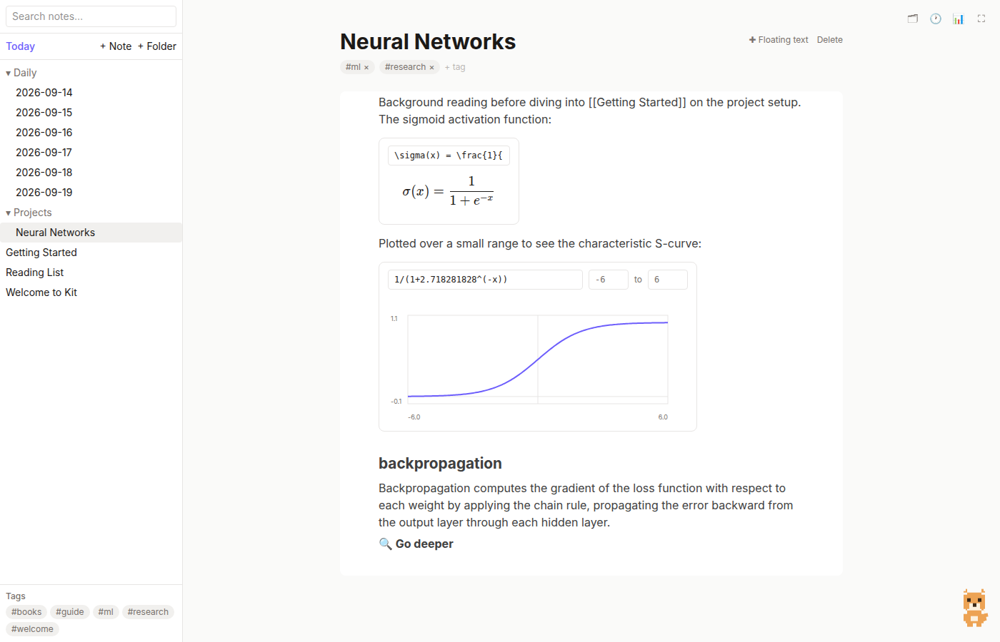

# Kit

A local-first, block-based note-taking desktop app built with Tauri, React, and TypeScript.

Notes live as plain markdown files (with a small YAML frontmatter header) on your own disk — no account, no lock-in, no cloud dependency. Kit is the app that reads and writes them.



📖 **[Read the full walkthrough](docs/WALKTHROUGH.md)** for a tour of every feature with screenshots.

## Features

- **Block-based editor** ([BlockNote](https://www.blocknotejs.org/)) — Notion-style editing with slash commands, checkboxes, images, file attachments, LaTeX equations, and function plots.
- **Organization** — real folders on disk, tags, `[[wiki-link]]` backlinks with a linked-mentions panel, and an auto-created daily note.
- **Search** — full-text search plus a fuzzy quick switcher (`Ctrl/Cmd+K`).
- **Floating text blocks** — OneNote-style free-floating, draggable text blocks placed anywhere on a note, alongside the normal flowing content.
- **AI-assisted terminology research** — select a term in a note and get an inline concise explanation, with a "go deeper" option for a fuller draft. The AI backend is currently stubbed (works fully offline); swapping in a real model is a one-file change (`src/lib/ai.ts`).
- **Edit history** — a git-blame-style gutter showing when each block was last touched, plus a time-travel panel to browse and restore past versions of a note.
- **Insights dashboard** — an activity heatmap, word-count trends, top tags, and note connectivity, all computed locally.
- **Focus mode** — hide the sidebar to give the editor the full window.
- **Desk buddy** — a small animated companion that reacts to saves, research, errors, and daily-note streaks, delivers a periodic recap, and shows a few vault stats and light housekeeping tips on hover.

## Development

Prerequisites: [Node.js](https://nodejs.org/) 20+, [Rust](https://www.rust-lang.org/tools/install), and the [Tauri system dependencies](https://tauri.app/start/prerequisites/) for your OS (on Linux: `libwebkit2gtk-4.1-dev`, `librsvg2-dev`, `libayatana-appindicator3-dev`, `libgtk-3-dev`).

```sh
npm install
npm run tauri dev    # launch the app in development
```

Other useful commands:

```sh
npm run build        # type-check and build the frontend
npm run test          # run the unit test suite
npm run lint          # lint the frontend
npm run tauri build   # build a native installer
```

## Recommended IDE setup

[VS Code](https://code.visualstudio.com/) + [Tauri](https://marketplace.visualstudio.com/items?itemName=tauri-apps.tauri-vscode) + [rust-analyzer](https://marketplace.visualstudio.com/items?itemName=rust-lang.rust-analyzer)
