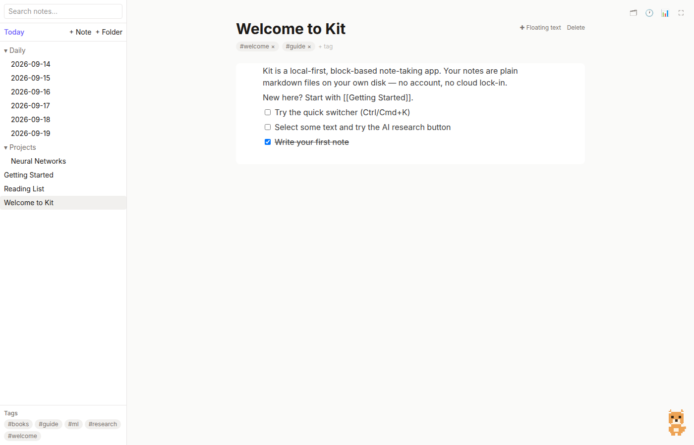
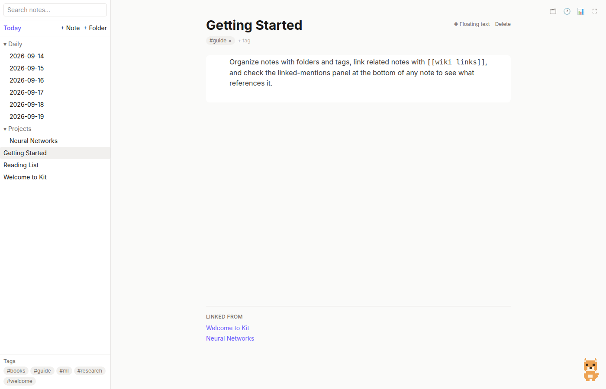
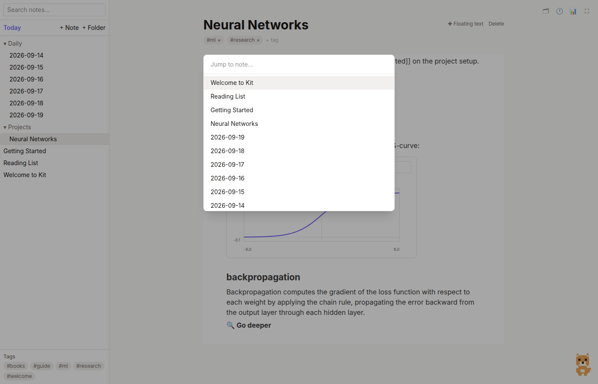
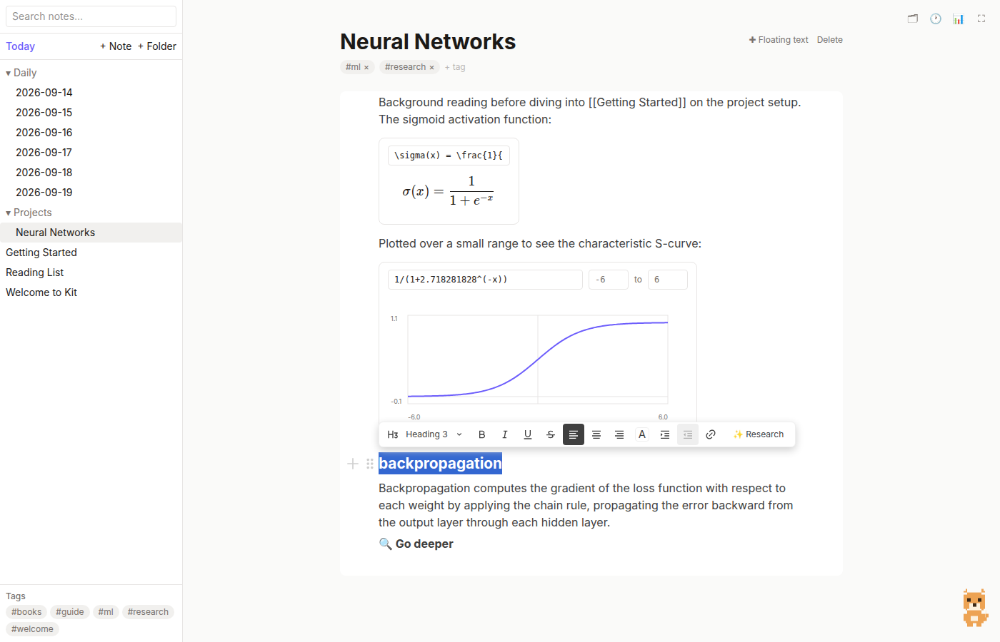
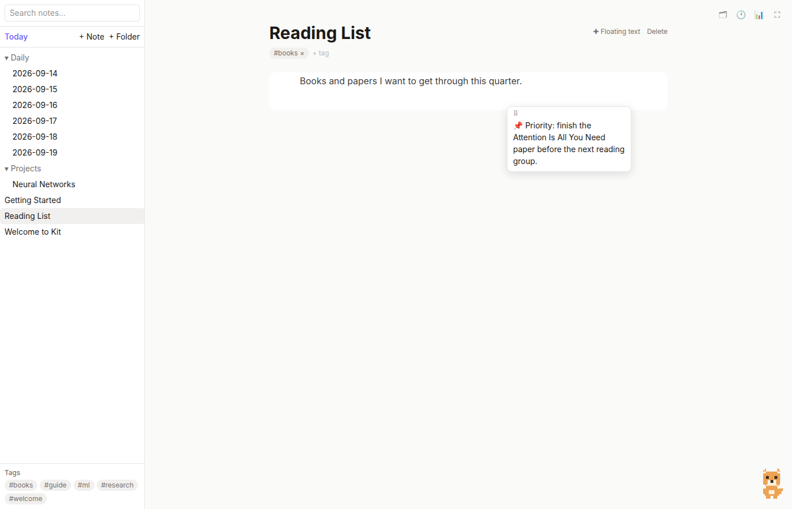
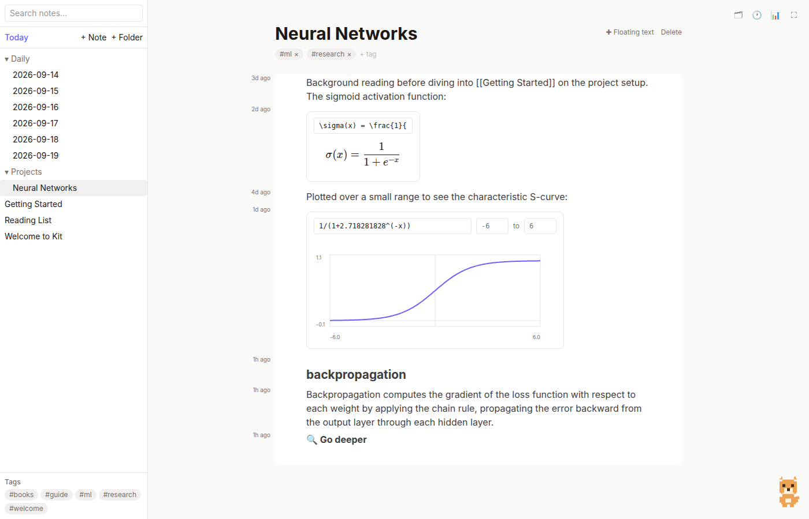
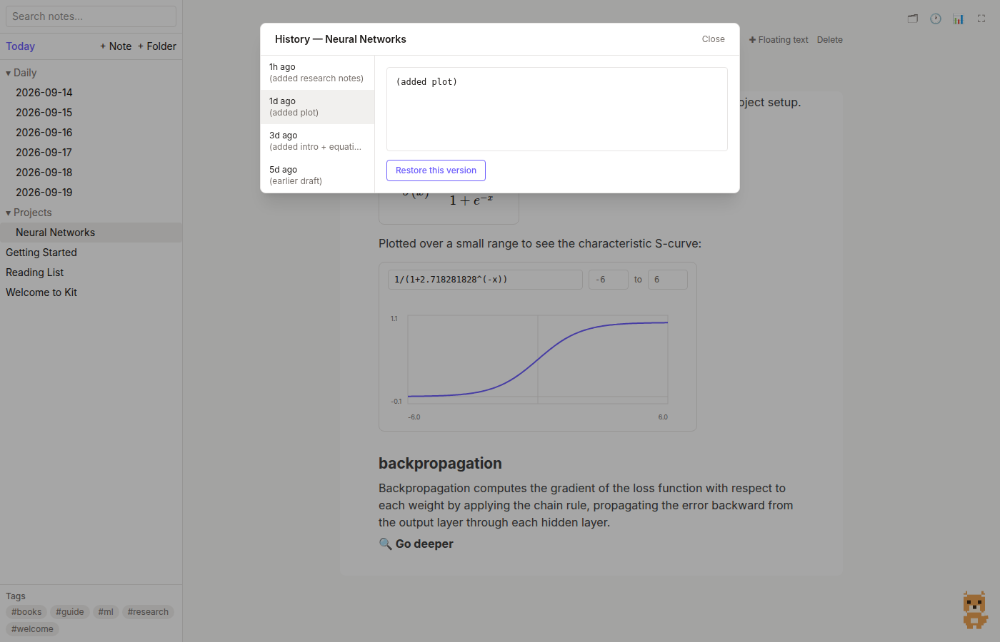
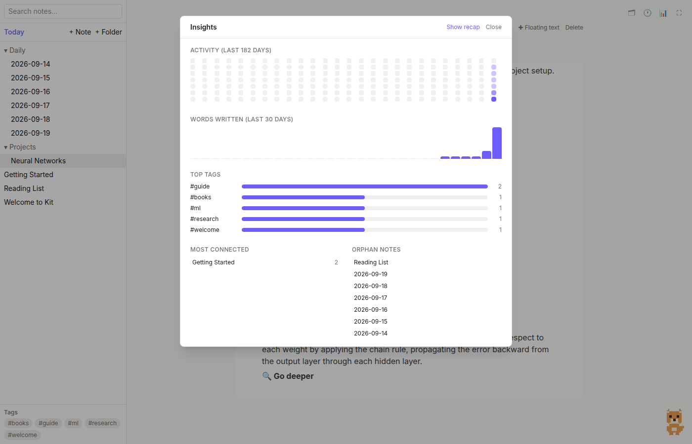
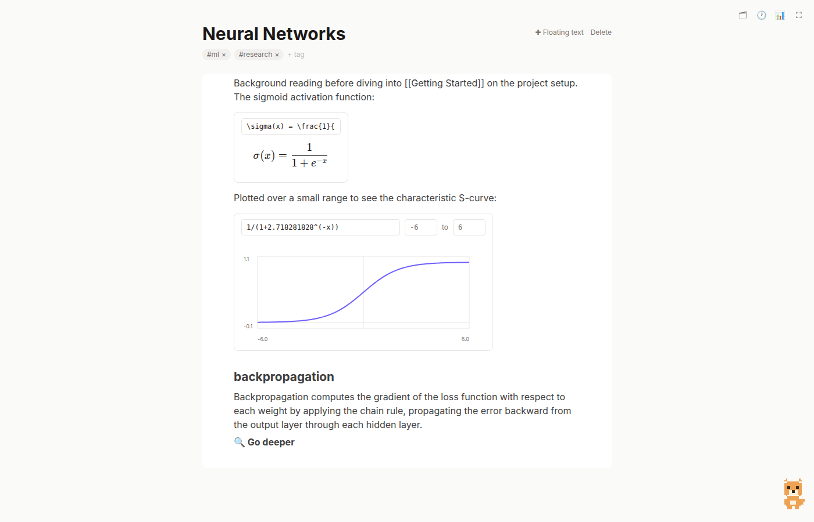
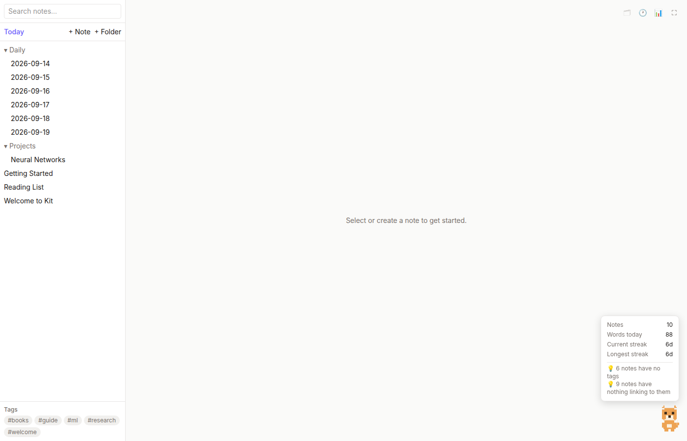

# Kit — A Walkthrough

Kit is a local-first, block-based note-taking desktop app. Every note is a plain markdown file that lives on your own disk — there's no account, no cloud dependency, and nothing stopping you from opening a note in a text editor if you ever want to. This guide walks through what Kit can do, feature by feature.

## Contents

- [The basics: folders, tags, and the block editor](#the-basics-folders-tags-and-the-block-editor)
- [Linking notes together](#linking-notes-together)
- [Daily notes and streaks](#daily-notes-and-streaks)
- [The quick switcher](#the-quick-switcher)
- [LaTeX equations and function plots](#latex-equations-and-function-plots)
- [AI-assisted research](#ai-assisted-research)
- [Floating text blocks](#floating-text-blocks)
- [Edit history, right in the margin](#edit-history-right-in-the-margin)
- [Time travel: browsing and restoring past versions](#time-travel-browsing-and-restoring-past-versions)
- [The Insights dashboard](#the-insights-dashboard)
- [Focus mode](#focus-mode)
- [Kit, the desk buddy](#kit-the-desk-buddy)
- [Why plain files](#why-plain-files)

---

## The basics: folders, tags, and the block editor

The sidebar shows your notes organized as real folders on disk — not a virtual filing system, an actual directory tree you could browse outside the app. Notes can carry any number of tags, shown as chips under the title and collected in a browsable list at the bottom of the sidebar.

The editor itself is block-based, in the style of Notion: every paragraph, heading, checklist item, and embed is its own block you can format, reorder, and build on with `/` slash commands.



## Linking notes together

Type `[[Note Title]]` anywhere in a note to link to another note — click it to jump there, or to create it on the spot if it doesn't exist yet. Every note has a **Linked from** panel at the bottom showing what references it, so you can always see how your notes connect without manually maintaining an index.



## Daily notes and streaks

Click **Today** in the sidebar to jump straight into an auto-created daily note — a lightweight home for a running log, journal entry, or scratch space. Kit tracks how many days in a row you've written one, shown in the buddy's stats popup and surfaced with a small celebration animation at 7/30/100/365-day milestones.

## The quick switcher

Press `Ctrl`/`Cmd`+`K` from anywhere to fuzzy-search every note by title and jump straight to it — no need to go hunting through folders.



## LaTeX equations and function plots

Type `/equation` to drop in a LaTeX block — write the source, see it rendered live via KaTeX. Type `/plot` to graph a function of `x`: Kit samples it safely (no `eval()` — arbitrary note content is never executed as code) and draws the curve as a simple line chart with axes.


Both persist as plain, portable markdown — an equation is saved as a fenced ` ```math ` code block and a plot as ` ```plot `, so the raw `.md` file stays readable and greppable even outside Kit.

## AI-assisted research

Select any term or phrase and a **✨ Research** button appears in the formatting toolbar. Click it and Kit drafts a concise explanation right into the note below your selection, with a **Go deeper** option to expand it into a fuller draft — meant as raw material you edit into your own words, not a final answer to leave untouched.



The backend is currently a clearly-labeled stub so the feature works fully offline out of the box; wiring up a real model is a one-file change (`src/lib/ai.ts`).

## Floating text blocks

Sometimes a note isn't a straight top-to-bottom document — you want a sticky note pinned in the margin, a callout floating next to a paragraph. Click **+ Floating text**, then click any blank space in the note, and a small draggable text block appears there, independent of the normal flow. Drag it anywhere by its handle.



## Edit history, right in the margin

Toggle the 🕐 icon and a slim gutter appears down the left edge of the note, showing when each block was last modified — like `git blame`, but for your notes. Hover any entry for the full "added X ago · modified Y ago" detail.



This is tracked automatically: every autosave diffs the current blocks against what was there before and records what changed, all stored in a small per-note sidecar file (`_history/`) that never touches the note's own markdown.

## Time travel: browsing and restoring past versions

Beyond per-block metadata, Kit keeps a capped rolling history of full snapshots for every note. Open the 🗂 **Note history** panel to browse past versions, preview any of them, and restore one with a click — restoring doesn't erase anything, it just becomes the newest entry in the history itself.



## The Insights dashboard

Click the 📊 icon for a read-only dashboard of your vault: a GitHub-style activity heatmap, a word-count trend for the last 30 days, your most-used tags, your most-connected notes, and any notes nothing links to yet.



## Focus mode

Click the ⛶ icon to hide the sidebar entirely and give the editor the full window — useful when you just want to write without the folder tree pulling your eye sideways.



## Kit, the desk buddy

A small pixel fox lives in the corner of the window. It's mostly decorative, but it's grown a few genuinely useful habits:

- **Hover** it to see quick vault stats — note count, words written today, your current and longest streaks — plus light housekeeping nudges like "3 notes have no tags."
- **Click** it to jump straight to the quick switcher.
- It reacts visibly to what's happening: a happy bounce on save, a thoughtful wobble while an AI research call is in flight, a shake if something goes wrong (with the error message available in its popup), and a spin with a banner on streak milestones.
- Once a day (or on demand from the Insights panel), it delivers a short recap: notes written this week, your streak, your top tag, your most-connected note.
- Left alone, it isn't static — it stretches, glances around, twitches an ear, and roughly every couple of minutes acts out whatever it'd plausibly be doing at the real-world time of day: morning coffee, a lunch break, working at a laptop, evening cooking, reading before bed, sleeping late at night.



## Why plain files

Everything above is built on top of one constraint: your notes are always just markdown files on your own disk. Folders are real folders. Tags, timestamps, and note IDs live in a small YAML frontmatter header. Even the fancier features — equations, plots, floating blocks — degrade to plain, readable fenced code blocks rather than some opaque binary format. Edit history lives in a separate sidecar folder that never touches the note itself. If Kit disappeared tomorrow, your notes wouldn't.
